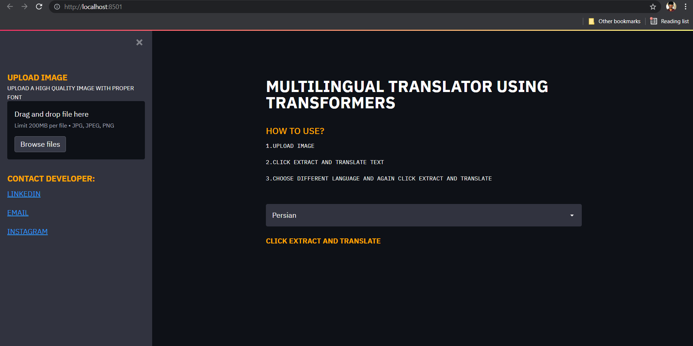
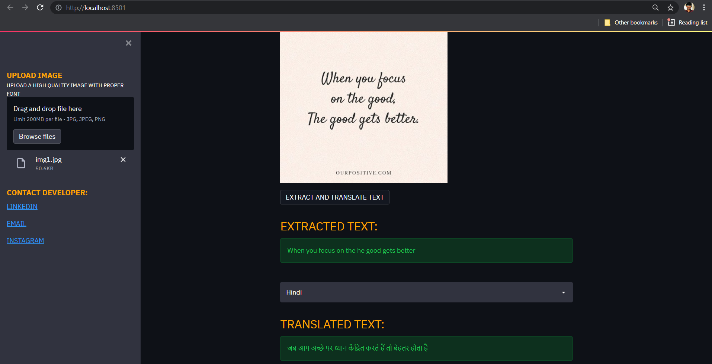
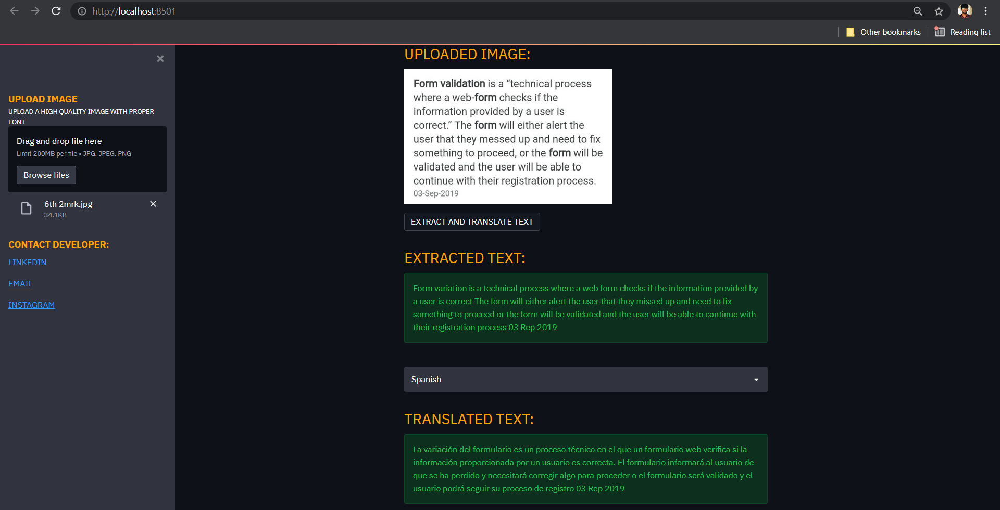

# MBART_50_STREAMLIT_TRANSLATOR
- <p>AN OCR AND MULTILINGUAL MACHINE TRANSLATOR USING 🤗<a href=https://huggingface.co/transformers/index.html>HUGGING FACE</a></P>
- **Found an image with unknown language??** Use my application to extract text from it and translate.
- Upload a high quality image with proper font and get the required TRANSLATIONS.
### REQUIREMENTS:

* python 3.7+
* pytorch == 1.9.0
* streamlit == 0.86.0

### CREATING VENV IN CONDA:
```sh
conda create --name myenv
```
Using a virtual environment:
```sh
conda activate myenv
```
Deactivating a virtual environment:
```sh
conda deactivate myenv
```
### INSTALLING DEPENDENCIES:
PYTORCH FOR CUDA 10.2:
```sh
conda install pytorch torchvision torchaudio cudatoolkit=10.2 -c pytorch
```
PYTORCH - CPU ONLY VERSION:
```sh
conda install pytorch torchvision torchaudio cpuonly -c pytorch
```
HUGGING FACE TRANSFORMERS 🤗:
```sh
pip install transformers
```
STREAMLIT:
```sh
pip install streamlit == 0.86.0
```

### RUNNING THE APPLICATION:
run :
```sh
streamlit run app.py
```
- Jump to http://localhost:8501 
- Your app will be hosted in the local server.
- Then deploy the app to cloud platforms but in our case, the free versions of Heroku and Streamlit Sharing won't handle whole 2.4GB pre-trained model (MBART-50).
- The home and the output pages of the web app is shown below:
<div class="row">
    
</div>
<div class="row">
    
</div>
<div class="row">
    
</div>
